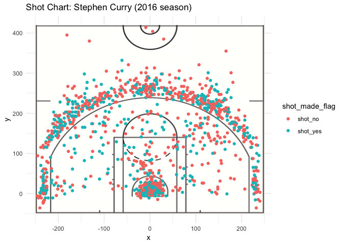
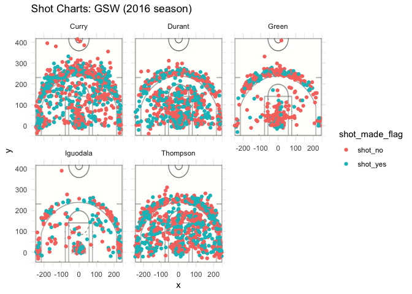

workout01-Mallika-Kolar
================
Mallika Kolar

The Fab 5 of the Golden State Warriors
======================================

In the last few years, the Golden State Warriors have proven themselves to be a force in the NBA. A new dynasty has formed under the leadership of Steve Kerr, leading the Warriors to win three Championships in the last four years. Steve Kerr has brought together a talented team led by the Fab 5: Stephen Curry, Draymond Green, Kevin Durant, Andre Iguodala, and Klay Thompson.

These players are superb shooters and have great overall statistics. Curry, especially, is a fantastic shooter, both in the paint and around the three-point range. In 2016, Curry made about 53% of his 2-point shots and approximately 41% of his 3-point shots. In three pointers, Curry only stands behind Tristan Thompson, who has the highest percentage of 3-point shots made— about 42%.

Curry isn’t the only member of the Fab 5 that can shoot. Both Andre Iguodala and Kevin Durant made approximately 63% and 60%, respectively, of their 2-point field goal attempts.

*Below is a summary of 2-point shot statistics for the Fab 5.*

| Name     | Shots Taken | Shots Made | Percentage |
|----------|-------------|------------|------------|
| Thompson | 580         | 246        | 42.4%      |
| Curry    | 687         | 280        | 40.7%      |
| Durant   | 272         | 105        | 38.6%      |
| Iguodala | 161         | 58         | 36.0%      |
| Green    | 232         | 74         | 31.8%      |

Overall, these five players together have amazing statistics. They make their baskets.

What else makes the Golden State Warriors such a good team
----------------------------------------------------------

The Warriors have the Fab 5. Not many NBA teams have a full starting lineup that is as talented and reliable as the Fab 5. All of the players make a good percentage of their shots. However, the players are also talented enough to score from a variety of positions on the court. Curry has the widest range.

    ## Warning: Removed 17 rows containing missing values (geom_point).

He is not only able to make shot after shot from the 3-point line, but he is also constantly near the basket, shooting jump shots and layups. Looking at his shot chart, he moves all over the court to make baskets.

This is the same for the rest of the Fab 5.

    ## Warning: Removed 22 rows containing missing values (geom_point).

The shot charts for Thompson and Durant are similar to Curry's chart All three players are able to make shots from all over the court. Iguodala also plays an important role. As a larger and stronger player, he is able to get rebounds and make shots near the basket.

Now with three championships under their belt, the Golden State Warriors must be feeling pressure to do well in upcoming seasons. However, as long as the Fab 5 are still here and play as we have seen in the past, the Warriors have a good chance to be in the finals again next year.

------------------------------------------------------------------------

*References*

<https://www.nba.com/article/2017/12/14/one-team-one-stat-warriors-shooting-better-ever> <https://shottracker.com/articles/are-the-warriors-making-the-mid-range-relevant-again>
